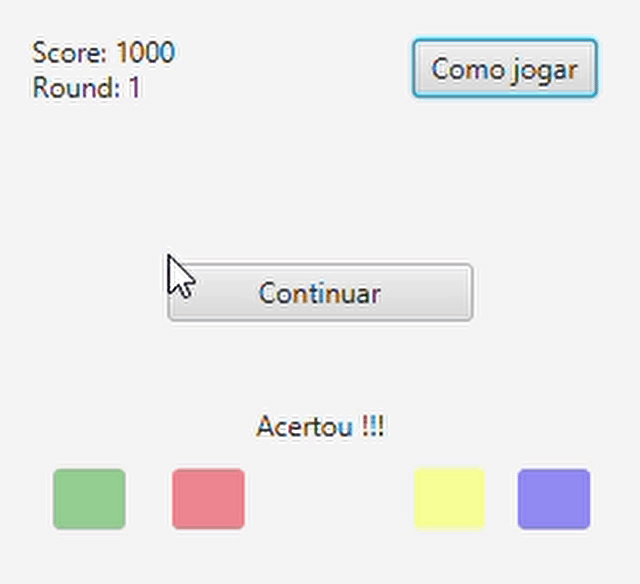

# Coloreh
Trabalho de programação concorrente: implementação de uma interface gráfica utilizando Java. 
## Mini-game
Repita as sequência de cores que aparecer no botão central para marcar pontos, quanto mais longe for mais pontos fará.

