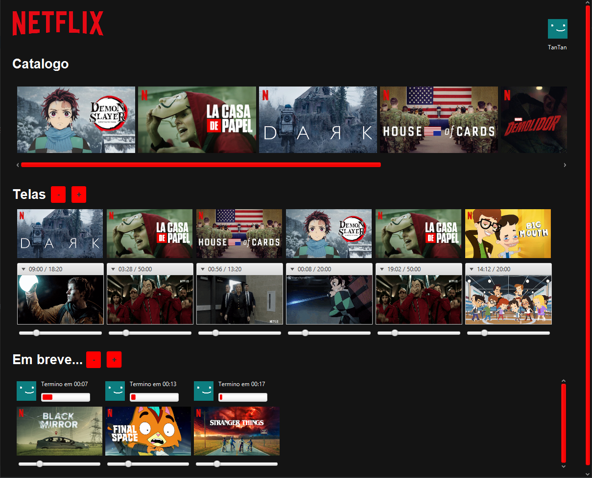

# Leitor e Escritor
Trabalho de programação concorrente que aplica uma solução para o problema clássico dos Leitores e Escritores.
Gui com tema netflix onde:
* Catálogo -> Buffer
* Telas -> Leitores
* Em breve -> Produtores

